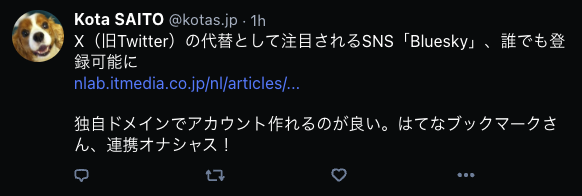

# Hateb to Bluesky

[](https://deploy.workers.cloudflare.com/?url=https://github.com/kotas/hateb-to-bluesky)

[はてなブックマーク](https://b.hatena.ne.jp/) でブックマークした記事を、自動で [Bluesky](https://bsky.app/) に投稿する [Cloudflare Worker](https://www.cloudflare.com/ja-jp/developer-platform/workers/) です。



## 使い方

[Node.js](https://nodejs.org/) の実行環境が必要です。

1. Cloudflare の KV で Namespace を作成します。
    ```
    $ npx wrangler kv:namespace create HATEB_BSKY
    ```
    - 作成された `id` を `wrangler.toml` の `kv_namespaces` に設定します。
    ```toml
    kv_namespaces = [
        { binding = "KV", id = "<作成された id>" }
    ]
    ```
2. Cloudflare の Secret に はてな ID, Bluesky の ID, パスワードを設定します。
    ```
    $ npx wrangler secret put HATENA_ID
    $ npx wrangler secret put BLUESKY_IDENTIFIER
    $ npx wrangler secret put BLUESKY_PASSWORD
    ```
    上記コマンド実行するとそれぞれ入力画面が表示されます。
    - `HATENA_ID`
        - はてな ID `id:kotas` の場合は `kotas` を入力
    - `BLUESKY_IDENTIFIER`
        - Bluesky ID `@ksaito.bsky.social` の場合は `ksaito.bsky.social` を入力
    - `BLUESKY_PASSWORD`
        - Bluesky のパスワードを入力 (暗号化されて Cloudflare に保存されます)
3. デプロイします。デフォルトでは 15 分ごとに cron 実行されます。
    ```
    $ npx wrangler deploy
    ```
4. デプロイ後に表示される URL (`https://*.workers.dev`) にアクセスすると、正しくデプロイできていれば下記のような情報が表示されます。
    ```
    hateb-to-bluesky v1.0.0
    Hateb:   https://b.hatena.ne.jp/kotas
    Bluesky: https://bsky.app/profile/kotas.jp
    ```
